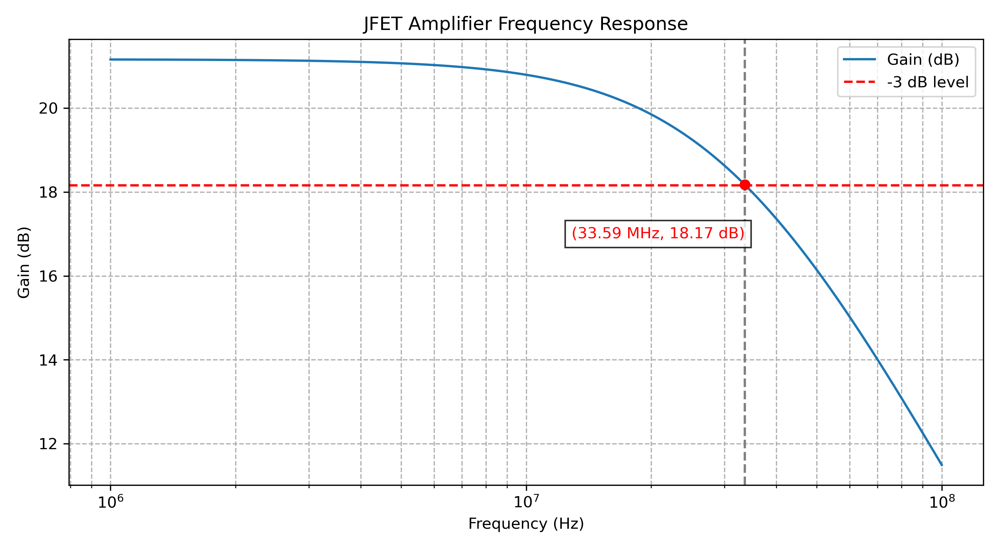

# ⚡️ JFET Amplifier – High Frequency Response Simulation

> 📈 Frequency response analysis of a **J310 JFET common-source amplifier**, combining **LTspice simulation** with **Python visualization**. Cutoff frequency, gain behavior, and Miller effect are explored with both practical plots and theoretical reports.

---

## 🔍 Overview

This project analyzes the **AC response** of a JFET-based amplifier at high frequencies, using:

- ✅ LTspice schematic simulation
- ✅ AC sweep data extraction
- ✅ Python plotting with cutoff frequency annotation
- ✅ Reported findings on **Miller effect**, bandwidth, and gain

---

## 📁 Project Structure

```
JFET-Amplifier-High-Frequency-Response-Simulation/
├── schematic/                     # LTspice schematic file
│   └── NJ.asc
│
├── simulation/                    # Exported gain data + LTspice plot
│   ├── NJ_Plot_Data.txt
│   └── jfet_frequency_response.png
│
├── plots/                         # Python plot script and image
│   ├── gain_plot_python.py
│   └── gain_plot_output.png
│
├── report/                        # Lab PDF reports and analysis
│   ├── JFET_Amplifier_Simulation_Report.pdf
│   ├── JFET_Cutoff_Miller_Effect_Analysis.pdf
│   └── Schaltungstechnik_Aufgabe_3.pdf
│
├── data/                          # Raw data if needed
│   └── NJ_Plot_Data.txt
│
├── .gitignore
└── README.md
```

---

## 🔬 Key Simulation Specs

| Parameter           | Value             |
|---------------------|------------------|
| Transistor          | J310 N-Channel JFET |
| Topology            | Common-Source     |
| AC Sweep Range      | 1 MHz – 100 MHz   |
| Max Gain            | ~21.16 dB         |
| −3 dB Cutoff Freq   | ~33.59 MHz        |
| Cause of Roll-Off   | Miller effect via \( C_{gd} \) |

---

## 🧪 How to Run

### ▶️ LTspice

1. Open `schematic/NJ.asc` in LTspice
2. Run `.ac oct 100 1meg 100meg` simulation
3. Export `V(n003)/V(n005)` as text to `simulation/NJ_Plot_Data.txt`

### ▶️ Python (via script)

1. Navigate to the `plots/` folder
2. Run the script to generate the annotated plot:

```bash
python gain_plot_python.py
```

This will output:

- `gain_plot_output.png` with cutoff frequency annotated
- Cutoff frequency printed in MHz

---

## 📊 Visualization



> 🔴 Cutoff frequency: **~33.59 MHz** where gain drops by 3 dB

---

## 🧠 Concepts Covered

- AC small-signal analysis
- JFET amplifier gain behavior
- High-frequency cutoff & bandwidth
- Miller capacitance effect
- Python-based data visualization

---

## 📘 References

- [📄 J310 Datasheet – onsemi](https://www.onsemi.com/pdf/datasheet/j310-d.pdf)
- University of Siegen – Chair of Analog Circuits & Image Sensors
- LTspice IV / XVII documentation

---

## 🧑‍💻 Author

**Mainak Roy**  
M.Sc. Electrical Engineering  
📍 Universität Siegen  
🔗 [github.com/roy-mainak](https://github.com/roy-mainak)


